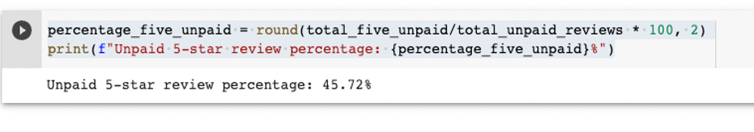

# Amazon_Vine_Analysis

## Overview

The purpose of this project is to analyze product reviews for a marketing company. A large data set containing book reviews was analyzed using PySpark to perform the ETL process to determine if there is any bias towards favorable reviews from those members being paid for reviews as part of the Amazon Vine Program versus those who are not in the paid program.

## Results

In order to focus on reviews that would be considered more informative, the data set was filtered by rows where the total votes count was greater than or equal to 20. These data were referred to as helpful votes. Then a new dataframe containing the rows where the percentage of helpful votes was equal to or greater than 50% was created. The following results are based on the helpful votes dataframe. 

* **How many Vine reviews and non-Vine reviews were there?**

    The total reviews done by Vine members was 5012. 
    
    
    
    The total reviews done by nonmembers was 109,297.
    
    

* **How many Vine reviews were 5 stars? How many non-Vine reviews were 5 stars?

    Vine members wrote 2031 5-star reviews while the non-Vine 5-star reviews 

    
    
    

* **What percentage of Vine reviews were 5 stars? What percentage of non-Vine reviews were 5 stars?

    Vine members had 40.52% that were 5 stars while the non-members had a percentage of 45.72% that were 5-star.
    
    
    
    
    
## Summary

Based on these results, there does not seem to be a positivity bias when rating products as part of the Vine program as the Vine members had a lower percentage of 5 star ratings than those of the non-members.  Broadening the original filters put on the dataset to determine “helpful” votes as well determining the mean, median, mode distribution of each data set could reveal further insights into the data set and possible bias.

    
